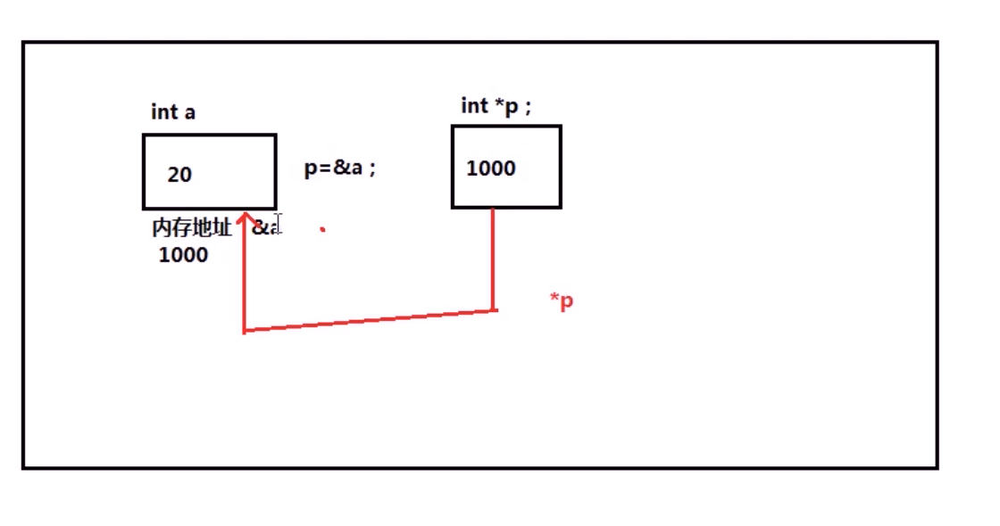

# pointer
> THINK CHANGE DO
- 指针变量 存储地址的变量。
- 整型变量 ```int i;```
- 声明指针变量 ```int *p```声明快乐一个int型的指针变量p   里面存储的地址 指向一个int型的变量。
- 例子：
```c
    int *p1;
    int i = 20;
    p1 = &i;
```

```c
//指针
#include<stdio.h>
int main()
{
    int i = 20;
    printf("i 地址是%p\n",&i);//& 取i变量的地址
    int *p = &i;//声明一个整形指针变量，存储i变量的地址
    printf("p=%x\n",p);//输出p内的值 16进制-
    printf("i = %d\n",*p); //* 取指针变量所指向的内存的值
    return 0;
}
```
输出
```bash
i 地址是0061FF18
p=61ff18
i = 20
```
- p中存放的是a变量的地址编号。

## 指针的作用

```c
#include<stdio.h>
void func(int *p);
void func(int *p)
{
    int *p2 =  p;
    *p2 = 30;
    printf("func函数中 *p2 = %d\n",*p2);
}
int main()
{
    int *p1;
    int i = 20;
    p1 = &i;
    printf("main函数中 调用前i = %d\n",i);
    func(p1);
    printf("main函数中调用后 调用后 i = %d\n",i);
    return 0;
}
```
- 指针可以修改变量作用域外面的值。
```c
int *p;
*p = 20;//野指针。声明一个指针变量，但是没有给他确定的位置。需要避免。
```
-避免野指针的方法：
1. 初始的时候指定确定的地址: ```int *p = i;```
2. 初始的赋值为NULL: ```int *p = NULL```


调用 ，声明， 定义

函数的组成：
返回值  函数名（参数）
{
    函数体
}

返回值只能返回一个变量
不能返回数组

函数的参数传递机制：-值传递（无法对函数外的变量进行修改）

- 函数的结束
    - 在遇到return语句的时候结束
    - 执行到最后一条语句的时候结束
    - return 0;

void型函数不需要返回值
```c
void()
{
    if()
    {
        exit(0);//结束程序
    }
    else()
    {
        ....
    }
}
```
如果if条件判断为真，那么执行完if之后就会结束函数。但是如果加上exit(0)，可以告诉系统，该 程序为正常结束的。
```c
#include<stdio.h>
void swap(int *a, int *b);
void swap(int *a, int *b)
{
    // int *temp = a;
    // a = b;
    // b = temp;
    int d = 0;
    int *c = &d;
     *c = *a;
     *a = *b;
     *b = *c;
}
int main()
{   int a = 2;
    int b = 3;
    // int *p1 = NULL;
    // int *p2 = NULL;
    printf("交换前 p1的地址为 %d\n",a);//print the add of p1
    printf("交换前 p2的地址为 %d\n",b);//print the add of p2
    swap(&a,&b);
    printf("交换后 p1的地址为 %d\n",a);//print the add of p1
    printf("交换后 p2的地址为 %d\n",b);//print the add of p2
        
}
```
- output
```bash
交换前 p1的地址为 2
交换前 p2的地址为 3
交换后 p1的地址为 3
交换后 p2的地址为 2
```

## 指针的运算
```c
#include<stdio.h>
int main()
{
    int a = 1;
    int b = 2;
    int c = 3;

    printf("&a = %p\n",&a);
    printf("&b = %p\n",&b);
    printf("&c = %p\n",&c);
    return 0;
}
```
- output
```bash
&a = 0061FF1C
&b = 0061FF18
&c = 0061FF14
```
## 指针的大小
```c
#include<stdio.h>
int main()
{
    int a = 1;
    char b = 2;
    int c = 3;
    int *pa = &a;
    char *pb = &b;
    printf("sizeof(pa) = %d\n",sizeof(pa));
    printf("sizeof(pb) = %d\n",sizeof(pb));
    return 0;
}
```
- output: 指针的大小是一样的
```bash
sizeof(pa) = 4
sizeof(pb) = 4
```


## 数组与指针
```c
#include<stdio.h>
int main()
{
    int a[5];
    char c[5];
    int *pa = &a[5];
    char *pc = &c[5];
    //打印数组a中各个元素的地址：
    for(int i = 0; i < 5;i++)
    {
        printf("a[%d]的地址为：%p\t",i,&a[i]);
    }
    printf("\n");
    for(int i = 0; i < 5;i++)
    {
        printf("  pa的地址为：%p\t",&pa);
        pa++;
        // printf("a[%d]的地址为：%p\t",i,&a[i]);
    }
    printf("\n");
    //打印数组c中各个元素的地址：
    for(int i = 0; i < 5;i++)
    {
        printf("c[%d]的地址为：%p\t",i,&c[i]);
    }
    printf("\n");
    for(int i = 0; i < 5;i++)
    {
        printf("  pc的地址为：%p\t",&pc);
        pa++;
        // printf("a[%d]的地址为：%p\t",i,&a[i]);
    }
    return 0;
}
```
- output
```bash
a[0]的地址为：0061FEFC  a[1]的地址为：0061FF00  a[2]的地址为：0061FF04  a[3]的地址为：0061FF08  a[4]的地址为：0061FF0C  
  pa的地址为：0061FEF0    pa的地址为：0061FEF0    pa的地址为：0061FEF0    pa的地址为：0061FEF0    pa的地址为：0061FEF0
c[0]的地址为：0061FEF7  c[1]的地址为：0061FEF8  c[2]的地址为：0061FEF9  c[3]的地址为：0061FEFA  c[4]的地址为：0061FEFB
  pc的地址为：0061FEEC    pc的地址为：0061FEEC    pc的地址为：0061FEEC    pc的地址为：0061FEEC    pc的地址为：0061FEEC
```

## 由于数组相当于已知函数的地址，所以可以通过void函数直接修改数组内部的值
```c
#include<stdio.h>
void func(int b[]);
void func(int b[])
{
    for(int i = 0; i<5; i++)
    {
        b[i] = i;
    }
}
int main()
{
    int a[5] = {10,20,30,40,50};
    func(a);
    for(int i = 0; i<5; i++)
    {
        printf("a[%d] = %d\n",i,a[i]);
    }
    return 0;
}
```
- output
```bash
a[0] = 0
a[1] = 1
a[2] = 2
a[3] = 3
a[4] = 4
```
## 练习
```c
#include<stdio.h>
void input(int a[],int len);
void output(int a[],int len);
int max(int a[],int len);
float avg(int a[],int len);

void input(int a[],int len)
{
    int *p = a;
    for(int i = 0; i< len; i++)
    {
        printf("输入一个数字: ");
        scanf("%d",p+i);
    }
}

void output(int a[],int len)
{
    int *p = a;
    printf("[");
    for(int i = 0; i< len; i++)
    {
        printf("%d\t",a[i]);
    }
    printf("]");
}

int max(int a[],int len)
{
    int max = a[0];
    for(int i = 1; i< len-1; i++)
    {
        if(max <= a[i])
        {
            max = a[i];
        }
    }
    return max;
}

float avg(int a[],int len)
{
    int sum = 0;
    float avg = 0;
    for(int i = 0; i < len; i++)
    {
        sum += a[i];
    }
    avg = sum/len;
    return avg;
}

int main()
{
    int a[5];
    input(a,5);
    output(a,5);
    printf("\nmax = %d\n",max(a,5));
    printf("avg = %f\n",avg(a,5));
    return 0;
}
```
- output
```bash
输入一个数字: 1
输入一个数字: 2
输入一个数字: 3
输入一个数字: 4
输入一个数字: 5
[1      2       3       4       5       ]
max = 4
avg = 3.000000
```