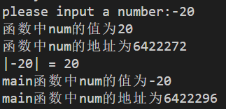

函数的格式：
```
声明函数的类型 函数名（函数的参数（可以没有））
{

函数体（功能);
}
```
函数的参数：
不加->无参数

函数体：可以为空,表示空函数
函数的结束：运行中遇到return 语句，函数结束
函数中遇到return语句时，结束函数，否则一直执行直到函数结束
在子函数里面调用exit(0) 结束程序。

tips ：函数中定义的参数与主函数中变量可能相同吗，，但是完全不是同一个变量。下图中显示，存储的位置不一样，同时num数值的大小也不一样。。。



函数的内部修改不了函数外部的局部变量。。。
函数只是将值传入变量当中，但是并没有修改。
需要返回才能修改。。。

```c
/*
用户输入密码 
如果成功， 返回1
如果3次，不成功，返回0
*/
//my own job:
#include <stdio.h>
int login();
int login(int password)
{
    if (password == 1998)
    {
        return 1;
    }
    else
    {
        return 0;
    }
}

int main()
{
    int password = 1998;
    int k = 3;
    while (k > 0)
    {
        printf("please input your password:");
        scanf("%d",&password);
        if (login(password))
        {
            break;
        }
        else
        {
            k--;
            printf("please try again!\n");
        }
    }
    if (k > 0)
    {
        printf("1");
    }
    else
    {
        printf("0");
    }
    return 0;
}
```