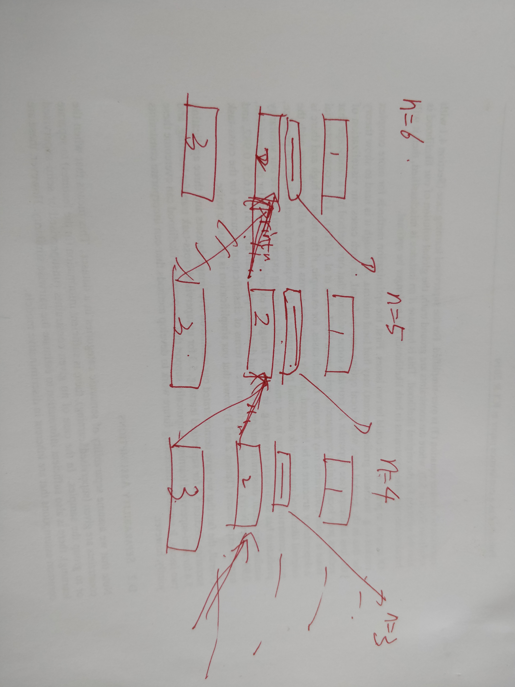
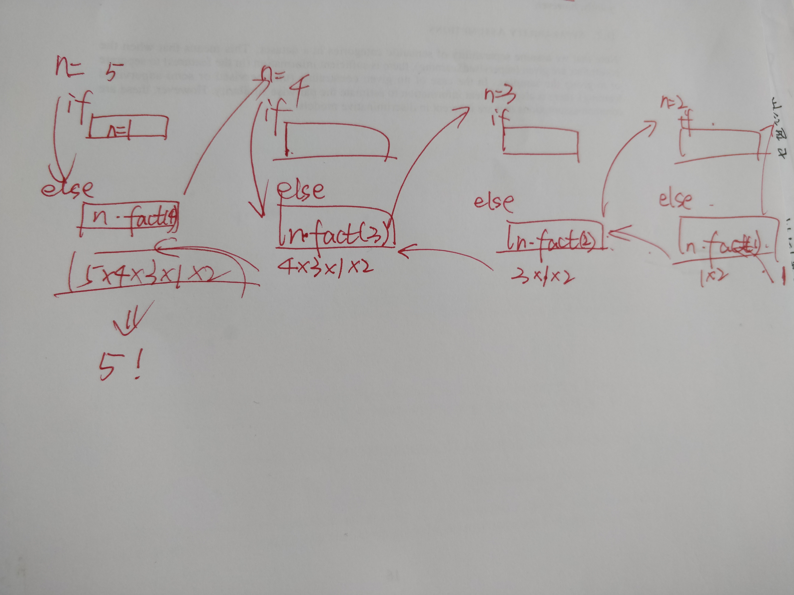

```C
#include<stdio.h>
#include<unistd.h>
void print_star(int n);
void print_star(int n)
{
    printf("start n = %d *\n",n);
    sleep(0.5);
    if(n>0)
    {
        print_star(n-1);
        printf("end n = %d \n",n);
    }
    else
    {
        printf("end n = %d \n",n);
        return ;
    }
}

int main()
{
    print_star(6);
    return 0;
}
```
```bash
PS D:\Learn\C++学习\github\C_language_practices> cd "d:\Learn\C++学习\github\C_language_practices\" ; if ($?) { gcc tempCodeRunnerFile.c -o tempCodeRunnerFile } ; if ($?) { .\tempCodeRunnerFile }      
start n = 6 *
start n = 5 *
start n = 4 *
start n = 3 *
start n = 2 *
start n = 1 *
start n = 0 *
end n = 0
end n = 1
end n = 2
end n = 3
end n = 4
end n = 5
end n = 6
```



```c
#include<stdio.h>
int fact(int n);
int fact(int n)
{
    if(n == 1)
    {
        return 1;
    }
    else
    {
        return n*fact(n-1);
    }
}

int main()
{
printf("5 的阶乘 = %d \n ",fact(5));
return 0;
}
```
```bash
PS D:\Learn\C++学习\github\C_language_practices> cd "d:\Learn\C++学习\github\C_language_practices\" ; if ($?) { gcc tempCodeRunnerFile.c -o tempCodeRunnerFile } ; if ($?) { .\tempCodeRunnerFile }
5 的阶乘 = 120 
```

